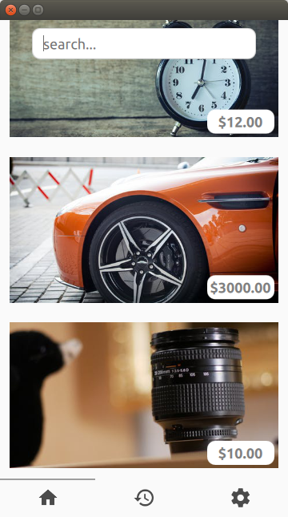
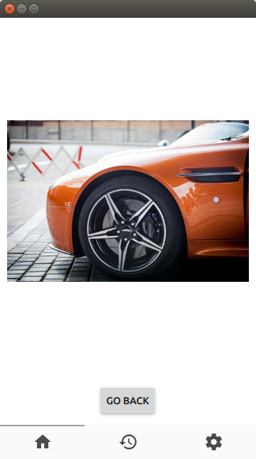

# ProjectK

An image is way more explicit than a paragraph... ;-)

  
  
  

# To support

Like what we are doing ? Donations are welcome ! 

 DOGE: <a href="http://dogechain.info/address/DS3kJgp3mAdezrV5bmKKoXkUiR5tqbrAgg">D716sA9JcQmGCRefX9w887QttkaekK1B33</a>

<a href="http://www.freebiebitcoin.com">Earn free bitcoin</a>
